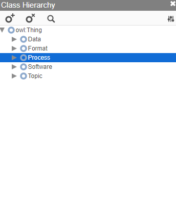
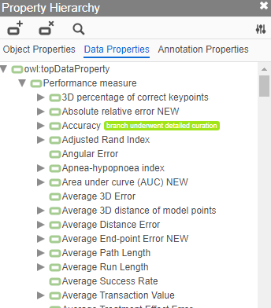

# Intelligence Task Ontology and Knowledge Graph (ITO) / AI ontology
## A comprehensive knowledge graph of artificial intelligence tasks and benchmarks
The Intelligence Task Ontology and Knowledge Graph (ITO) provides comprehensive, curated and interlinked data of artificial intelligence tasks, benchmarks, AI performance metrics, benchmark results and research papers.

You can [browse ITO online at BioPortal](https://bioportal.bioontology.org/ontologies/ITO/?p=classes&conceptid=https%3A%2F%2Fidentifiers.org%2Fito%3AITO_00141).

### Examples
ITO aims to provide a richly structured hierarchy of processes, algorithms, data and performance metrics. Data on thousands of AI benchmark results have been imported from [Papers With Code](https://paperswithcode.com/) and are further curated.

An example of a benchmark result embedded in an ontological hierarchy:

Exploring the class hierarchy:

> 

Exploring the hierarchy of perfomance measures:

> 

### Using ITO

ITO is made available as an OWL (Web Ontology Language) file. You can use the [Protege ontology editor](https://protege.stanford.edu/) to explore and edit the resource. You can use a wide variety of frameworks for OWL, RDF and the SPARQL graph query language to access and query the ontology. We recommend using the [Blazegraph](https://blazegraph.com/) triple store. 

Example: [Google Colab notebook demonstrating SPARQL queries with ITO](https://colab.research.google.com/drive/1g3gDgakBcmAfIi4opXX99KXB7yALK66S?usp=sharing).

### Citing ITO

> Kathrin Blagec, Adriano Barbosa-Silva, Simon Ott, Matthias Samwald. „A curated, ontology-based, large-scale knowledge graph of artificial intelligence tasks and benchmarks“. arXiv:2110.01434 [cs], October 2021. http://arxiv.org/abs/2110.01434

### Licensing

The ontology file is distributed under a [CC-BY-SA](https://creativecommons.org/licenses/by-sa/4.0/) license.

ITO includes data from the Papers With Code project (https://paperswithcode.com/). Papers With Code is licensed under the CC-BY-SA license. Data from Papers With Code are partially altered (manual curation to improve ontological structure and data quality).

ITO includes data from the EDAM ontology. The EDAM ontology is licensed under a CC-BY-SA license.

We offer ITO and related resources as-is and make no representations or warranties of any kind concerning the resources, express, implied, statutory or otherwise, including without limitation warranties of title, merchantability, fitness for a particular purpose, non infringement, or the absence of latent or other defects, accuracy, or the present or absence of errors, whether or not discoverable, all to the greatest extent permissible under applicable law.

### Contact

[Samwald research group](https://samwald.info/) @ Section for Artificial Intelligence and Decision Support, Medical University of Vienna
matthias.samwald (at) meduniwien.ac.at

This project received funding from netidee.

