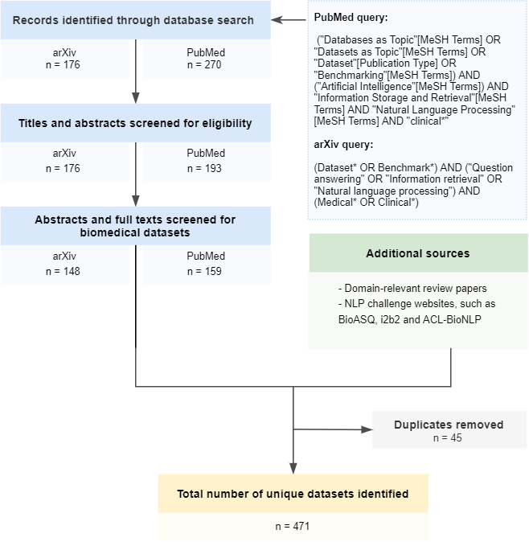

# A living catalogue of artificial intelligence datasets and benchmarks for medical decision making

This folder contains code to generate statistics for the data descriptor paper "*A living catalogue of artificial intelligence datasets and benchmarks for medical decision making*".
Authors: Kathrin Blagec, Jakob Kraiger, Matthias Samwald.

In this paper, we describe the creation of a comprehensive curated catalogue of **artificial intelligence datasets** and **benchmarks for medical decision making**. At the time of first release (April 2021), the dataset contains more than 400 biomedical and clinical datasets of which 252 are publicly available or available upon request.
The current version of the catalogue is available as a TSV file on Zenodo:

>  Blagec Kathrin, Kraiger Jakob, & Samwald Matthias. (2021). A living catalogue of artificial intelligence datasets and benchmarks for medical decision making (Version 0.1.1) [Data set]. Zenodo. http://doi.org/10.5281/zenodo.4668570

Additionally, the dataset can be explored live via [this Google Spreadsheet](https://docs.google.com/spreadsheets/d/1QjUxxnZ3tuyW5dj6nkt_o5yJcWUZec4ttfJxO8Zlty4/edit?usp=sharing). The dataset is intended as a living, extendable resource. Edit suggestions and additions are encouraged and can be submitted via the comment function of the Google sheet.

## About the dataset

The catalogue was compiled based on a systematic literature review covering both biomedical and computer science literature and grey literature data sources. 

All datasets were manually systematized and annotated for meta-information, such as:

* Availability and licensing information
* Type of source data
* Links to source publications, main references or dataset repositories

Benchmark dataset were additionally annotated for the following information:

* Associated task
* Performance metrics commonly used for evaluation
* Clinical relevance
* The availability of data splits

## Resources in this folder

### Notebooks

The Jupyter notebook ['dataset-statistics'](https://github.com/OpenBioLink/ITO/blob/master/notebooks/AI_datasets_and_benchmarks/dataset-statistics.ipynb) contains
code to create basic statistics for the dataset. Statistics are based on version 0.1.1 of the dataset (http://doi.org/10.5281/zenodo.4668570).

