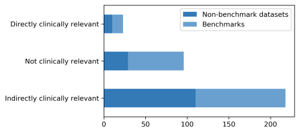
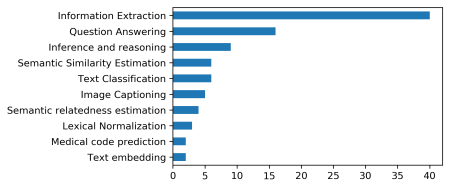
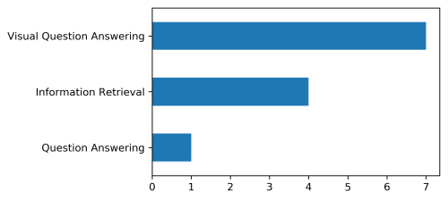

# Additional resources for 'Datasets driving Artificial Intelligence development fail to capture real-life needs of medical professionals'

This folder contains additional resources for the paper "*Datasets driving Artificial Intelligence development fail to capture real-life needs of medical professionals*".
Authors: Kathrin Blagec, Jakob Kraiger, Wolfgang Frühwirt, Matthias Samwald.

In this paper, we analyse the current availability of **clinically relevant AI benchmarks**, their strengths and weaknesses, and point out opportunities for advancing AI for clinical applications.

## Quick navigation

* [Additional resources](#additional-resources)
    - [Data basis](#definitions-of-terms-used-in-the-paper)
  - [Definitions of terms used in the paper](#definitions-of-terms-used-in-the-paper)
  - [Notebooks & basic statistics](#notebooks-and-basic-statistics)
  - [Task coverage](#task-coverage)
  - [Directly clinically relevant benchmarks](#directly-clinically-relevant-benchmarks)
    + [Rating of clinical relevance and usefulness](#rating-of-clinical-relevance-and-usefulness)
        * [Ranking](#ranking)

## Additional resources

### Data basis

Our previously compiled dataset covering more than 400 biomedical and clinical datasets and benchmarks served as the data basis for our analysis:

>  Blagec Kathrin, Kraiger Jakob, & Samwald Matthias. (2021). A living catalogue of artificial intelligence datasets and benchmarks for medical decision making (Version 0.1.1) [Data set]. Zenodo. http://doi.org/10.5281/zenodo.4668570

#
### Definitions of terms used in the paper

**Table 1:** Definitions of terms used in this analysis

| Term                                  | Definition                                                                                                                                                                                                                                                                                                                                                                |
|---------------------------------------|---------------------------------------------------------------------------------------------------------------------------------------------------------------------------------------------------------------------------------------------------------------------------------------------------------------------------------------------------------------------------|
| Clinical                              | “Relating to the examination and treatment of patients and their illnesses”  (Oxford dictionary)                                                                                                                                                                                                                                                                          |
| Benchmark dataset                     | “Any resource that has been published explicitly as a dataset that can be used for evaluation, is publicly available or accessible on request, and has clear evaluation methods defined”                                                                                                                                                                                  |
| Clinically relevant benchmark dataset | “Benchmark datasets directly relating to the entirety of processes involved in the examination and treatment of patients and their illnesses.”                                                                                                                                                                                                                            |
| Information retrieval (IR)            | “Obtaining information system resources that are relevant to an information need from a collection of those resources” (Source: Wikipedia).                                                                                                                                                                                                                               |
| Question answering (QA)               | “Building systems that automatically answer questions posed in a natural language” (Source: Adapted from Wikipedia).                                                                                                                                                                                                                                                      |
| Clinical care task                    | Tasks that are directly related to the examination and treatment of patients and their illnesses. Includes reviewing and searching for medical information using a variety of information sources, such as books, scientific literature or web-based information content. Includes the analysis and interpretation of diagnostic tests including medical imaging results. |
| Administrative task                   | Administrative tasks include, e.g., scheduling and managing patient appointments, filing, updating, and organizing patient records or coding medical records for billing.                                                                                                                                                                                                 |
| Scientific task                       | Tasks related to the coordination, conduct or reporting of clinical scientific research. Includes e.g., the selection of eligible patients for clinical trials.                                                                                                                                                                                                           |
#
### Notebooks and basic statistics

Code to generate the following and other basic statistics on the datsets and benchmarks can be found in the Jupyter Notebook '`clinically_relevant_benchmarks.ipynb`'.

 

**Figure 1:** Distribution of benchmark and non-benchmark datasets across the categories 
'Directly clinically relevant', 'Not clinically relevant' and 'Indirectly clinically relevant'.
#

 

**Figure 2:** Top 10 task types of indirectly clinically relevant benchmarks

#

  

**Figure 3:** Top 10 task types of directly clinically relevant benchmarks

#

### Task coverage

The file `data/clinical_tasks.tsv` contains data used to assess the coverage of real-world clinical work activites by tasks addressed in biomedical and clinical NLP research. 
The list of clinical work activities we used stems from a recent work by [Frühwirt and Duckworth](https://arxiv.org/pdf/1910.09444.pdf), which is based on the [O*NET database](https://www.onetonline.org/) and represents the first comprehensive quantitative evidence of healthcare practitioners’ preferences regarding the automation of their own work activities.

For our analysis, we filtered the list for tasks commonly performed by MDs, 
whereas we excluded tasks primarily done by other personnel involved in healthcare, such as psychologists or technical assistants. 
Further, only tasks commonly performed my MDs that could potentially be assisted by natural language processing were considered in our analysis.

To assess task coverage, we then mapped the list of clinical tasks to the list of clinical and biomedical natural language processing tasks extracted from our dataset of biomedical and clinical datasets and benchmark datasets: [Blagec et al. 2021](http://doi.org/10.5281/zenodo.4668570)

We further organised the list of clinical tasks into the categories (1) clinical care tasks, (2) administrative tasks, and (3) scientific tasks. Tasks occurring in the scientific literature that were targeted at basic clinical/biomedical NLP research were assigned into a separate class ‘Improving clinical/biomedical NLP’.

#

### Directly clinically relevant benchmarks
*State: 19.05.2021*  
*Based on Version 0.1.1 of the dataset.*

**Table 2**: Benchmarks identified as directly clinically relevant and their properties.

| Name or Description                                | Task                      | Primary target group    | Accessibility | Licensing                                        | Data type                                        | Generation process                                                                                               | Number of items                                                                                                                                                                                                                     | Number of annotators                                                                                   | Source/Paper                                            | Repository                                                          |
|------------------------------------------------------------|---------------------------|-------------------------|---------------|--------------------------------------------------|--------------------------------------------------|------------------------------------------------------------------------------------------------------------------|-------------------------------------------------------------------------------------------------------------------------------------------------------------------------------------------------------------------------------------|--------------------------------------------------------------------------------------------------------|---------------------------------------------------------|---------------------------------------------------------------------|
| ShAReCLEF eHealth 2013 Task 3: Document retrieval          | Information Retrieval     | Patients                | On request    | PhysioNet Credentialed Health Data License 1.5.0 | Clinical notes / EHR data                        | Manual generation of queries                                                                                     | Training set: 5 development queries,  Test set: 50 test queries                                                                                                                                                                  | Not stated                                                                                             | [Link](https://sites.google.com/site/shareclefehealth/) | [Link](https://www.physionet.org/content/shareclefehealth2013/1.0/) |
| TREC CDS task 2014                                         | Information Retrieval     | Clinicians              | Public        | Not stated                                       | Biomedical scientific literature                 | Manual generation of topics                                                                                      | 30 topics, PMC snapshot covering 733,138 articles                                                                                                                                                                                | Not stated                                                                                             | -                                                       | [Link](http://www.trec-cds.org/)                                    |
| TREC CDS task 2015                                         | Information Retrieval     | Clinicians              | Public        | Not stated                                       | Biomedical scientific literature                 | Manual generation of topics                                                                                      | Task A: 30 topics, Task B: 30 topics, PMC snapshot covering 733,138 articles                                                                                                                                                        | Not stated                                                                                             | -                                                       | [Link](http://www.trec-cds.org/)                                    |
| TREC CDS task 2016                                         | Information Retrieval     | Clinicians              | Public        | Not stated                                       | Biomedical scientific literature                 | Manual generation of topics                                                                                      | 30 Topics, PMC snapshot covering >1.25 million articles                                                                                                                                                                             | Not stated                                                                                             | -                                                       | [Link](http://www.trec-cds.org/)                                    |
| TREC-COVID                                                 | Information Retrieval     | Clinicians              | Public        | Not stated                                       | Biomedical scientific literature                 | Manual relevance annotation, Generation of topics via community input, extraction from queries and media sources | Round 1  Articles: 51,103 Topics: 30 Round 2 Articles: 59,851  Topics: 35 Round 3  Articles:128,492  Topics: 40 Round 4 Articles:157,817  Topics: 45 Round 5 Articles:191,175 Topics: 50  | 17 MesH indexers, 10 OHSU medical students, 40 individuals with a medical or biomedical science degree | [Link](https://ir.nist.gov/covidSubmit/)                | [Link](https://ir.nist.gov/covidSubmit/data.html)                   |
| Dataset based on 56 real life diagnostic cases (FindZebra) | Information Retrieval     | Clinicians              | Public        | Not stated                                       | Biomedical scientific literature                 | Extracted from online resources                                                                                  | 56 real life diagnostic cases and top 20 retrieved documents                                                                                                                                                                        | Top 20 retrieved documents annotated for relevance by authors                                          | [Link](https://arxiv.org/pdf/1303.3229.pdf)             | [Link](https://arxiv.org/pdf/1303.3229.pdf)                         |
| emrQA                                                      | Question-answering        | Clinicians              | On request    | n2c2 NLP Data Use Agreement                      | Clinical notes / EHR data                        | Automatic generation of question-answer pairs                                                                    | QA pairs: 1,957,835, QL pairs: 1,225,369                                                                                                                                                                                            | -                                                                                                      | [Paper](https://github.com/panushri25/emrQA)            | [Link](https://www.aclweb.org/anthology/D18-1258/)                  |
| PathVQA                                                    | Visual question-answering | Pathologists            | Public        | Not stated                                       | Histology images                                 | Semi-automated generation of question answer-pairs based on images and captions                                  | 32,799 question-answer pairs across 4,998 images                                                                                                                                                                                    | -                                                                                                      | [Link](https://pubmed.ncbi.nlm.nih.gov/23462700/)       | [Link](https://pubmed.ncbi.nlm.nih.gov/23462700/)                   |
| VQA-RAD                                                    | Visual question-answering | Clinicians/Radiologists | Public        | CC0 1.0 Universal                                | Medical images; Clinical question-answer pairs   | Manual generation of question-answer pairs based on images                                                       | 2248 across 315 images from 315 unique patients                                                                                                                                                                                     | 1-15 volunteer clinical trainees                                                                       | [Link](https://www.nature.com/articles/sdata2018251)    | [Link](https://osf.io/89kps/)                                       |
| ImageCLEFmedical 2018 Visual Question Answering (VQA)      | Visual question-answering | Clinicians              | Public        | Not stated                                       | Radiology images; Clinical question-answer pairs | Semi-automated generation of question answer-pairs based on images and captions                                  | 6,413 question-answer pairs across 2,866 medical images                                                                                                                                                                             | Quality check by 1 annotator with unknown expertise and 1 annotator with clinical expertise            | [Link](https://www.imageclef.org/2018/VQA-Med)          | [Link](https://www.imageclef.org/2018/VQA-Med)                      |
| ImageCLEFmedical 2019 Visual Question Answering (VQA)      | Visual question-answering | Clinicians              | Public        | Not stated                                       | Radiology images; Clinical question-answer pairs | Automatic generation of question-answer pairs                                                                    | Training set: 12,792 Question-answer pairs across 3,200 medical images,Validation set: 2000 Question-answer pairs across 500 medical images, Test set: 500 questions across 500 medical images                                      | Test set:  Manual validation by two medical doctors                                                 | [Link](https://www.imageclef.org/2019/medical/vqa/)     | [Link](https://www.imageclef.org/2019/medical/vqa/)                 |
|                                                            |                           |                         |               |                                                  |                                                  |                                                                                                                  |                                                                                                                                                                                                                                     |                                                                                                        |                                                         |                                                                     |

#

## Rating of clinical relevance and usefulness

Directly clinically relevant benchmarks were further rated for their relevance to clinical work and their
validity for clinical practice. The following process served to evaluate the datasets tasks from a medical perspective: 

The benchmark datasets and associated tasks were evaluated in a two-step process. First, 
the clinical relevance of the tasks was rated by two MDs (KB&JK) based on a scale ranging from “1-not relevant” to
“5-highly relevant”. Second, given the task and the associated dataset, representativeness for clinical work was rated based on a scale ranging
 from “1-not representative” to “5-highly representative”. 
 
 Given the two scoring schemes, the datasets were ranked by
calculating the sum of scores of the relevance and representativeness ratings.

### Ranking

**Table 3:** Ranking of benchmarks based on their relevance and representativeness for clinical work activities.

| Ranking | Benchmark                                     | Score* |
|---------|----------------------------------------------|--------|
| 1       | FindZebra: A search engine for rare diseases | 10     |
| 2       | ImageCLEFmedical 2018 Visual Question Answering (VQA) | 8      |
| 2       | ImageCLEFmedical 2019 Visual Question Answering (VQA) | 8      |
| 3       | VQA-RAD                                      | 7      |
| 4       | PathVQA                                      | 6      |
| 5       | TREC CDS task 2016                           | 5      |
| 5       | TREC CDS task 2015                           | 5      |
| 5       | TREC CDS task 2014                           | 5      |
| 5       | emrQA                                        | 5      |
| 5       | ShAReCLEF eHealth 2013 Task 3: Document retrieval     | 5      |
| 5       | TREC-COVID                                   | 5      |

\*Sum of the scores of relevance and representativeness