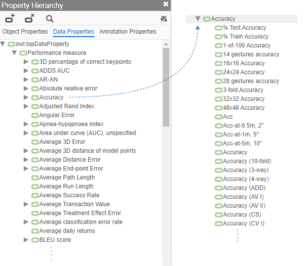

# AI performance metrics taxonomy

This folder contains a [JSON file](https://github.com/OpenBioLink/ITO/blob/master/notebooks/performance_metrics_json_export/data.json) with an export of the AI performance measure taxonomy of the [Intelligence Task Ontology](https://github.com/OpenBioLink/ITO). This taxonomy was created through exporting raw performance measure data from the [Papers With Code](https://paperswithcode.com/) repository and conducting extensive manual curation (i.e., adding canonical top-level properties).

Please note that in the current taxonomy, many of the subproperties might actually be equivalent to their superproperty, and are subproperties only because their label in is non-canonical (e.g., "Acc" being a subproperty of "Accuracy").

*Property hierarchy after manual curation of the raw list of metrics. The left side of the image shows an excerpt of the list of top-level performance metrics; the right side shows an excerpt of the list of submetrics for the top-level metric ‘Accuracy’.*

This folder also contains a Jupyter notebook that was used to generate the JSON export from the ITO source.

The files are distributed under a [CC-BY-SA](https://creativecommons.org/licenses/by-sa/4.0/) license.

If you use the taxonomy for research purposes, please cite:

Kathrin Blagec, Georg Dorffner, Milad Moradi, Matthias Samwald. **A critical analysis of metrics used for measuring progress in artificial intelligence** (2020), [preprint on arXiv](https://arxiv.org/abs/2008.02577)

